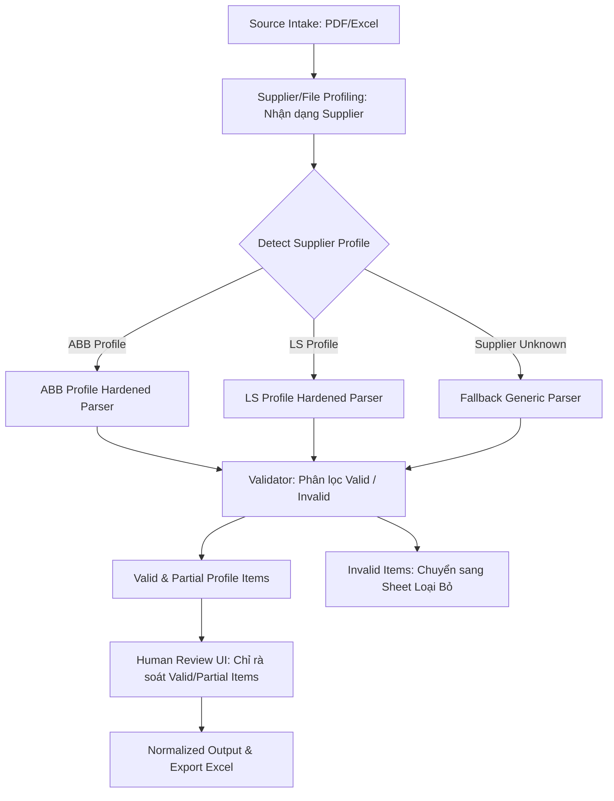

# Báo Cáo Tổng Kết Khả Thi & Định Hướng Lộ Trình Kỹ Thuật (Feasibility Summary & Roadmap Reset)

Báo cáo này tổng hợp kết quả kiểm chứng khả thi độc lập (Feasibility Reset) trên hai nhà cung cấp (NCC) benchmark là ABB và LS sau phiên bản nâng cấp cải tiến v1, từ đó định hình lại cấu trúc kỹ thuật và lộ trình triển khai mới của dự án.

---

## 1. Executive Summary
* **Đánh giá hệ thống cũ**: Pipeline dùng chung (Generic PDF line-based pipeline) ban đầu **không đạt** mục tiêu bóc tách bảng giá của các nhà cung cấp từ tệp PDF thật. Việc gom dòng văn bản thuần túy không dựa trên tọa độ cột chi tiết dẫn đến trộn lẫn các dòng tiêu đề, chân trang và ghi chú vào danh sách vật tư, gây lệch đơn giá nghiêm trọng.
* **Đánh giá giải pháp mới**: Hướng đi sử dụng **Coordinate Column Profiler** kết hợp **Supplier Profile Parser** (bóc tách theo tọa độ cột đặc thù của từng hãng) chứng minh được tính khả thi rất tốt.
* **Trạng thái hiện tại**: 
  * Hãng ABB đạt trạng thái **PASS feasibility** với hiệu năng bóc tách rất cao trên các trang kiểm thử.
  * Hãng LS đạt trạng thái **PARTIAL feasibility** với độ phủ được cải thiện rõ rệt.
* **Khuyến nghị tích hợp**: **Chưa sẵn sàng tích hợp trực tiếp vào pipeline chính và chưa mở lại giao diện UI rà soát cũ.** Hệ thống chưa đạt đến mức độ sẵn sàng cho vận hành thực tế mà mới hoàn thành giai đoạn kiểm chứng khả thi (feasibility).

---

## 2. Kết Quả Thử Nghiệm Hãng ABB v1 (ABB Benchmark Result)
* **Số trang thử nghiệm**: 13 trang (các trang bảng tiêu biểu trong tệp PDF gốc).
* **Thống kê trạng thái trang**:
  * **PASS** (Tỷ lệ lỗi <= 5% và Valid >= 10): **13 / 13 trang đạt PASS** (Đạt tỷ lệ 100% số trang thử nghiệm).
  * **PARTIAL**: **0 trang**.
  * **FAIL**: **0 trang**.
* **Thống kê vật tư**:
  * **Tổng số vật tư hợp lệ (Valid)**: **743 items** (Tăng từ 681 ở v0, khôi phục thành công các mã OT, OXP, OETL sạch và mã ACB Emax2 sạch nhờ loại bỏ tiền tố MP/FP).
  * **Tổng số vật tư bị loại bỏ (Invalid)**: **2 items** (Giảm mạnh từ 205 ở v0 nhờ cơ chế lọc sớm các dòng rác không có giá).
* **Đánh giá Layout**:
  * Layout đạt PASS tốt: `double_column_3p_4p` phân bộ cột sạch sẽ; `single_column_right` tách model AX và mã 1SBL qua Regex tốt; `four_columns_ot_page41` mới giúp bóc tách đúng các mã OT switch-disconnector.
* **Kết luận**: Phiên bản ABB v1 đạt kết quả PASS feasibility vững chắc, chứng minh tính hiệu quả của phương pháp định vị cột.

---

## 3. Kết Quả Thử Nghiệm Hãng LS v1 (LS Benchmark Result)
* **File LS được chọn**: `Bang gia LS ap dung ngay 15-04-2026.pdf`.
* **Số trang thử nghiệm**: 5 trang benchmark đầu tiên (Trang 1 đến trang 5).
* **Thống kê trạng thái trang**:
  * **PASS**: **3 trang** (Trang 1, Trang 3 và Trang 4 đạt độ chính xác cao với tỷ lệ lỗi dưới 5%).
  * **PARTIAL**: **2 trang** (Trang 2 và Trang 5).
  * **FAIL**: **0 trang**.
* **Thống kê vật tư**:
  * **Tổng số vật tư hợp lệ (Valid)**: **282 items** (Tăng mạnh từ 224 ở v0 nhờ mở rộng dải cột mã hàng lề phải sang 291.0 và nới lỏng kiểm tra danh sách dòng định mức dính phẩy).
  * **Tổng số vật tư bị loại bỏ (Invalid)**: **19 items** (Đã đồng bộ thống nhất theo số lượng thực tế bóc tách trong JSON).
* **Đánh giá Layout**:
  * Layout đạt PASS tốt: Trang 1, Trang 3 (MCB/RCBO lề phải được cứu sống) và Trang 4 (Contactor/Rơ le) có cột phân bố đối xứng rõ rệt.
  * Layout PARTIAL/Lỗi: Trang 2 và Trang 5 gặp khó khăn nhẹ ở một số dòng phụ kiện hoặc thiết bị đặc thù do mã hàng bắt đầu lệch khỏi tọa độ chuẩn.
* **Kết luận**: Phiên bản LS v1 đạt kết quả PARTIAL feasibility, có cải thiện rất lớn so với v0 và đáng để tiếp tục phát triển.

---

## 4. Bài Học Rút Ra (Lessons Learned)
1. **Không được thiết kế pipeline phức tạp trước khi chứng minh khả năng bóc tách**: Việc xây dựng quá nhiều bước trung gian (line_candidates, row_candidates, item_candidates) khi chưa định vị được cột tọa độ thực tế dẫn đến lãng phí tài nguyên và khó gỡ lỗi.
2. **Không dùng pytest/schema làm tiêu chí chất lượng sản phẩm**: Test pass chỉ có nghĩa là code chạy đúng cấu trúc và không crash, không đồng nghĩa với việc dữ liệu bóc tách được là chính xác và có ý nghĩa đối với người dùng cuối.
3. **Không gọi parser là thành công nếu chỉ đọc được văn bản**: Đọc được text PDF nhưng không tách được mã vật tư sạch và đơn giá tương ứng thì kết quả bóc tách vẫn là không đạt.
4. **Không làm UI khi parser chưa có dữ liệu tin cậy**: Việc dựng giao diện UI rà soát quá sớm trên một pipeline thô chỉ làm hiển thị thông tin thiếu chính xác và làm giảm lòng tin của người sử dụng.
5. **Phải thực hiện feasibility audit trên file thật trước**: Luôn thử nghiệm bóc tách trực tiếp trên các trang bảng giá thực tế trước khi phát triển các logic tự động hóa diện rộng.

---

## 5. Bảng Phân Loại Độ Tin Cậy Của Artifact (Artifact Trust Classification)

| Phân Nhóm | Tên Artifact | Mức Độ Tin Cậy / Tái Sử Dụng |
| --- | --- | --- |
| **Trusted / Reusable** | `source/original.pdf` | Tin cậy (Tệp đầu vào gốc). |
| | `source/pages/` | Tin cậy (Tệp ảnh/trang PDF bóc tách riêng). |
| | `source/raw_text` | Tin cậy (Văn bản thô trích xuất từ PDF). |
| | `package metadata` | Tin cậy (Thông tin nhà cung cấp, ngày ban hành). |
| | `feasibility_outputs/abb_profile_v1/` | Tin cậy (Kết quả bóc tách khả thi v1 của ABB). |
| | `feasibility_outputs/ls_profile_v1/` | Tin cậy (Kết quả bóc tách khả thi v1 của LS). |
| **Not Trusted as Product Data** | `line_candidates` | Không tin cậy (Chứa quá nhiều dòng rác, title dính phẩy). |
| | `row_candidates` | Không tin cậy (Ghép dòng sai cấu trúc cột bảng). |
| | `item_candidates` | Không tin cậy (Chứa vật tư bẩn, thiếu mã hàng/đơn giá thực). |
| | `normalized_draft` | Không tin cậy (Sinh từ generic parser cũ). |
| | Kết quả review UI | Không tin cậy (Bị loãng do hiển thị dòng rác/tiêu đề). |
| | `normalized.json` / Export Excel cũ | Không tin cậy (Thiếu độ tin cậy để đưa vào sản xuất). |

---

## 6. Kiến Trúc Mới Đề Xuất (New Recommended Architecture)

* **Điểm cốt lõi**: Loại bỏ hoàn toàn generic line parser làm lõi chính. Chuyển sang mô hình bóc tách dựa trên cấu hình tọa độ đặc thù của từng hãng (**Supplier-Specific Profile Parser**).

---

## 7. Các Cột Mốc Mới Sau Reset (Roadmap Reset)
* **Milestone C: Supplier profile config format** (Đã hoàn thành)
  * Chuẩn hóa cấu trúc cấu hình dải cột, Regex và validation rule ra các tệp JSON độc lập dưới thư mục `profile_configs/`, viết loader kiểm chứng tệp cấu hình.
* **Milestone D: Supplier profile config integration**
  * Refactor lại parser của ABB và LS để đọc dải cột trực tiếp từ tệp JSON cấu hình thông qua loader thay vì viết cứng trong mã nguồn Python.
* **Milestone E: Profile router**
  * Xây dựng bộ nhận dạng tự động (Profile Router) dựa trên metadata và văn bản thô để tự động định tuyến tệp đầu vào tới profile cấu hình tương ứng.
* **Milestone F: Human review UI mới**
  * Thiết kế lại giao diện rà soát Streamlit để chỉ hiển thị các vật tư thuộc danh sách Valid/Partial đã qua profile parser. Tuyệt đối không đưa các dòng tiêu đề rác lên giao diện.

---

## 8. Điều Kiện Dừng Triển Khai (Stop Conditions)
* **Khó khăn cấu hình thủ công**: Nếu việc cấu hình profile đòi hỏi phải tinh chỉnh thủ công chi tiết cho từng tệp báo giá đơn lẻ (thay vì áp dụng chung cho một nhà cung cấp theo năm phát hành), hệ thống sẽ không có khả năng nhân rộng.
* **Thay đổi layout liên tục**: Nếu NCC thay đổi cấu trúc bảng hoàn toàn sau mỗi phiên bản báo giá ngắn hạn, chi phí bảo trì cấu hình profile sẽ vượt quá lợi ích mang lại.
* **Hiệu suất không cải thiện**: Nếu tỷ lệ valid items trên tổng số vật tư bóc tách không đạt trên $85\%$ sau 2-3 vòng tuning dải cột, phương pháp Coordinate Column Profiler cần được dừng lại để đánh giá lại hướng đi khác.
* **Excel-First**: Nếu có sẵn tệp Excel báo giá gốc từ nhà sản xuất, dự án cần ưu tiên xây dựng pipeline đọc Excel trực tiếp (Excel-First) thay vì cố gắng bóc tách từ tệp PDF.
